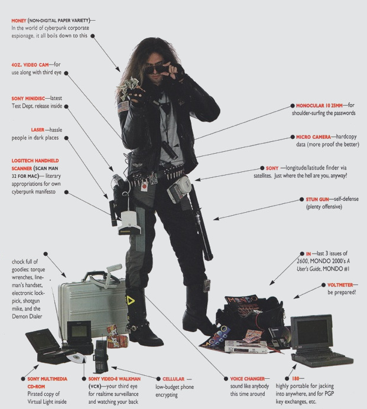

# Crack 400 - A Hard Row to Hoe
## Description
This summer I had a chance to meet up with some future cybersecurity professionals. Young people that have an interest in cybersecurity and plan to enter the field when they grow up. One of them told me something I've heard here and there in the community. "Password length doesn't matter. It's all about complexity." Let's put that to the test. Here we have a kdb. The password for it is no greater that eight characters. Upper, lower, 0-9, and special characters. Maximum complexity. Minimal effort.

A hint has been released for this challenge during Wave 3. [Crack 400 Hint 1](https://pointeroverflowctf.com/Crack400%20Hint)

### Crack 400 Hint 1
I had promised to release a hint for Crack 400 - A Hard Row to Hoe if we had no solves by this point in the contest. Here are your hints: With apologies to all contestants, I've been winding you all up a bit. During planning for Crack 400, I planned to pretend to be getting a lot of complaints about it and make those complaints become increasingly unhinged as the contest went into the third week. I did not actually expect any real complaints, but I couldn't resist an opportunity to play it up a little when the opportunity presented itself. But I have not been lying at all. Doing that is actually against one of the contest axioms. So, there is a path to success, as I said. There are several, actually, but the one I expect most of you to follow is to simply do as I suggested. Relax, it is a very long contest, play my games and you will learn a few things to help you. The truth is: I have already revealed two of the characters in the password. The next character will be revealed in wave 7. Then wave 10. Then wave 14. Then wave 16. Then wave 17. Then wave 18. The longer you play and the more you find, the easier the challenge will get. You don't even need to do any brute forcing at all. All you need is a little luck, a little patience, and a notebook and pencil. It's not easy. In play testing, it took me about 68 hours to solve the challenges and assemble the password. So you see - I haven't told a single lie. This challenge isn't worth any points, but I introduce to you all a secret game: Project 400 - Meaningful Errors.

## Solution
Seems like a straightforward cracking challenge: extract the hash, crack the hash? Let us do a sanity check first.

We assume the special characters as defined by KeePass the following 22 characters: 
```!"#$%&'*+,./:;=?@\^`|~``` We therefore have a keyspace of $(26*2+10+22)^8 \approx 2.5*10^{15}$ or about 51 bits of entropy, which is infeasible to bruteforce on our hardware (CPU only, 50 H/s).

Additional information is needed...

Each of the other 400 difficulty challenges contained clues which confirmed certain characters.
- Crypto 400 - A question of perspective: interpret the qubits as a bitstring and convert to bytes: **Crack400-y**.
- Stego 400 - He pretends to be a boor: the numbers on the computer screen can be decoded to **Crack400-B**.
- Forensics 400 - No irony in rain: a faint morse code can be heard which decodes as **CRACK400-P**.
- Exploit 400 - Imperfect Impermanent and Incomplete: the target file `Crack400_hint.txt` contains **Crack400-z**.
- Reverse 400 - Forjeskit Sair with Weary Legs: one of the variables in the program contains the value **Crack400-X**.
- Misc 400 - My Synthetic Friend: steganography analysis on the grid provided shows hidden information which can be decoded as **Crack400-%**.
- Web 400 - A Bitter Delicacy: clue not found.
- OSINT 400 - I couldn't bring myself to shoot: clue not found.

There were also some intentional errors in those challenge descriptions which could be used to eliminate characters (the characters that could be excluded were those of the misspelled word and the word before and after):
- of thier quantum
- Johnson hsa been
- 24 veiws after
- ...

In the Discord channel, there were also some clues (e.g. the picture SPOILER_crack400.jpg) to eliminate a few characters.



From this picture, the red capital letters can be removed from the character set.

The order of the confirmed characters could be deduced from the alphabetic ordering of the challenge categories: crypto, exploit, forensics, misc, osint, reverse, stego, web.

The password for the kdb was ultimately found using `hashcat` as **yzP%3XB1** (about halfway the contest, in week 8).
```
hashcat -O --session Crack400 -o Crack400_cracked.txt -m 13400 -a 3 Crack400.hash Crack400.hcmask
```
The following mask file was used:
```
XQFcdjkxpz1379,!#$%&"'*+./:;=@^??,y?1P?1?1?1B?2
XQFcdjkxpz1379,!#$%&"'*+./:;=@^??,y?1P?1?1?2B?1
XQFcdjkxpz1379,!#$%&"'*+./:;=@^??,y?1P?1?2?1B?1
XQFcdjkxpz1379,!#$%&"'*+./:;=@^??,y?1P?2?1?1B?1
XQFcdjkxpz1379,!#$%&"'*+./:;=@^??,y?2P?1?1?1B?1
```

## Flag
`poctf{uwsp_Sh4d0w5_0f_7h3_P457}`


