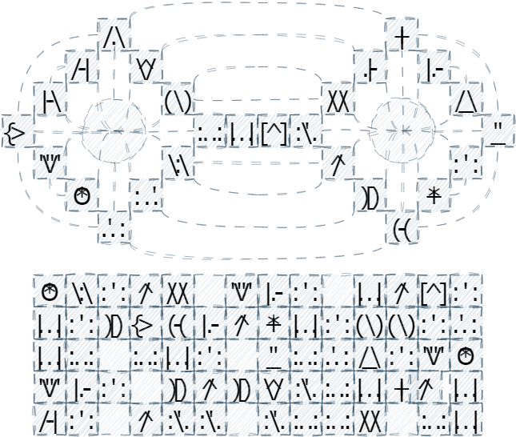

# Crypto 100-3 - For All the World to See 
## Description
In an ancient Babylonian city, archaeologists are busy working to uncover an ancient palace complex. Along the way they discover a stone outhouse. Curiously, the two-seats are adorned with carved figures that could be some form of language, and the base has several lines of similar figures. I have provided a copy of the sketches taken by those present for the discovery. At the bottom of the outhouse they uncover an ancient VeraCrypt container, which no doubt holds the secrets of the former inhabitant of this ancient palace.

Right Click, Save As... [An Ancient VeraCrypt Container](https://pointeroverflowctf.com/static/Crypto100-3)

MD5 checksum E090EAC2DC961FBE98CAC79431AAD6C3

## Solution
Assume a simple substitution cipher. A possible transcription of the ciphertext is "fivzp esv mznv mvydxszwmvjjvg ml lmv ulgtvef esv yzykolmrzm bv zoo ollp lm" which [quipqiup](https://quipqiup.com/) solves as "speak the name nebuchadnezzer no one forgets the babylonian we all look on". 

Using **Nebuchadnezzar** as the password for the VeraCrypt container solves the challenge. Note that the challenge ciphertext has changed in the new version to reflect the "e->a" spelling mistake.

## Flag
`poctf{uwsp_c0n57ruc75_0f_d00m}`
