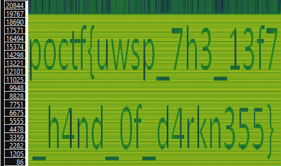

# DF 200-2 - Known Unknowns
## Description
So, I was laying in an open field with my super sensitive directional mic, trying to listen to stars like I do every Saturday night. You know, normal stuff. It was going fine and I was jamming out to the sounds of Saturn when I hear this sound coming through. I'm guessing it's the sound of swamp gas reflecting off Jupiter.

Right Click, Save As... [Alien Rock and Roll](https://pointeroverflowctf.com/static/DF200-2.wav)

MD5 checksum: D6DC86EF24773511E55F9CA167D47C7E

## Solution
Spectrogram.

## Flag
`poctf{uwsp_7h3_13f7_h4nd_0f_d4rkn355}`