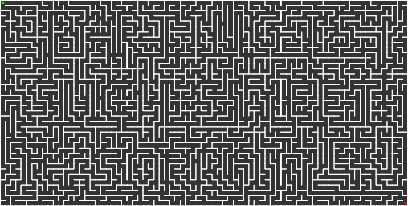
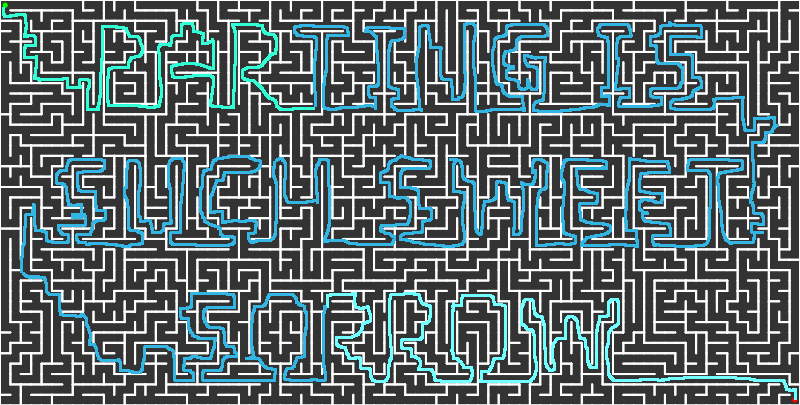

# Misc 200-3 - Anything Worth Doing Wrong
## Description
Autumn in the Midwest USA brings about many strange traditions. Hay wagon rides, corn husk dolls, numerous inedible gourds strewn about the place (I assume to ward off ghosts), and let's not forget the corn field maze. Well, it may not be corn, but here's a maze for you to solve while I try to find out where all these gourd are coming from before they take over. They're like tribbles. It's insane.

NOTE: Your solution will produce a phrase using normal English words. You will need to format it as a flag before you submit it per the rules on flag formats on the contest website. 

## Solution
Solve the maze, either manually or programmatically.

## Flag
`poctf{uwsp_p4r71n6_15_5uch_5w337_50rr0w}`
