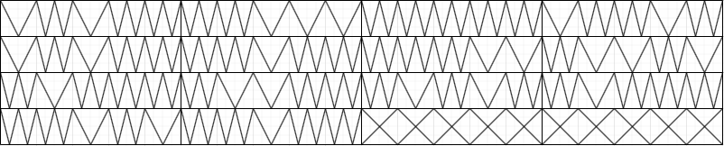

# Misc 300-3 - Decieved by Touch
## Description
"Knowledge is power." I believe that. I think one of the biggest problems we have with our society today is the breakdown of our information dissemination systems and the commodification and restriction of every stage of the DIKW pyramid. Data is monopolized, bought and sold freely in data markets. Information is restricted, pay-walled, censored, available by subscriptions or micro-transactions only. Without information we can't attain knowledge. Without knowledge we can't attain wisdom. Without knowledge we have no agency. Without wisdom we have no power. Instead, we are doomed to be controlled by those we have allowed to rob us of what is rightfully ours - the things we create, the ideas we have, and our ability to share our knowledge with the world.

It is my hope that contests like this train you to find secrets and dismantle the walls they erect. I know I sound salty and that these ideas aren't kosher to express in most circles, but I'm not suggesting anyone become a vigilante or do anything illegal. It is haram to do so, but not to point out injustice or exploitation when we see it. I am asking you to crisp up, and become part of the solution. You can start by sizzling the secret out of the image below. You will need to convert it to the flag format with this: poctf{uwsp_ _ _ _ _ } 

## Solution
Apply [Bacon cipher](https://www.dcode.fr/bacon-cipher) where `A=W` and `B=V`. (There are several hints to the cipher in the description.)

`VWVWW WWVVV WWWWW VWWVW VWVWW WWVWW WWWVV WVVWV WVWWW WVVWW WVWVW WVWWW WWVWV WWVWW` 

## Flag
`poctf{uwsp_wh47_w3_d0_1n_l1f3}`
