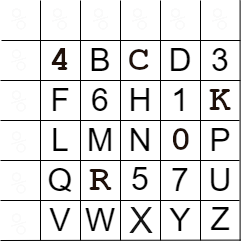
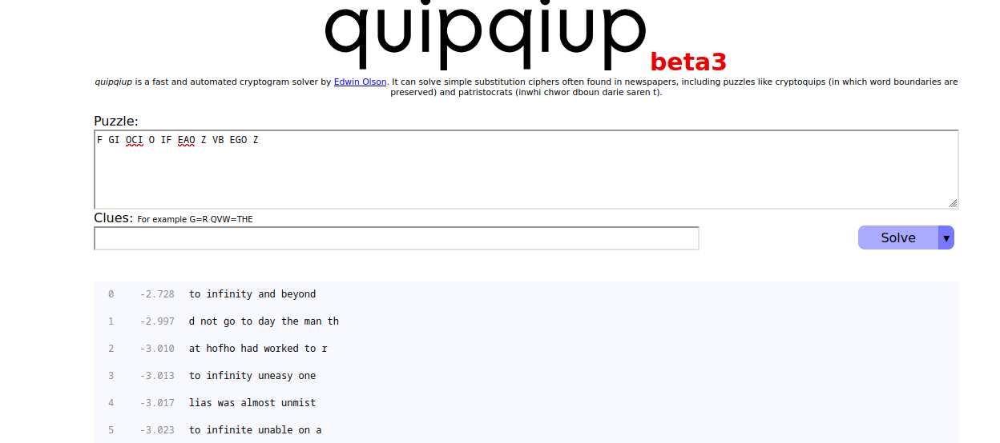

# Misc 400 - My Synthetic Friend
## Description
If you played in last year's contest, you might recall that there was one challenge that was infamously difficult. Just a real pain to solve. The kind that makes you just want to give up and go home. It was awful for everyone involved.

So, let's do that again!

The cipher text below is triple encrypted. I will give you clues on each step, and you will need to work out the puzzle to move on. The problem is that you'll only get the next ciphertext and won't know if you've made a mistake along the way until you get to the end!

My last step is your first. You'll need the grid below, and hang onto it because you'll need it again later. And no cheating. I have a real problem with cheating because my brother used to lie when we played Battleship and I'd be sitting there calling out hits and he'd be like, "No, dude, that's a miss" and it's like COME ON but you can't look to see if he's lying because then YOU'RE the cheater!!

Ciphertext: poctf{uwsp_BABD_BBBDACCDCDBABDCD_AAAEEE_ABEACDBBAEEE}

We pass by each other on the second step. Now you get to make your own grid! You'll need to work out the method. It's named after a figure of command and strategy. This cipher was a tool of war, simple yet effective, trusted in the field by those who followed its namesake. Oh, and you'll need a key for this one. It's a single word and your clue is 🕛 + 🍽️

My first step is your last and.... Wait... This can't be right. MORE grids? That doesn't make sense. How many grid ciphers could there possibly be?? Hmm... Oh, ok this one also has transposition. So we get a little of that flavor, too. Well, you know who else, historically, has created lots of ciphers? Nerds. Nerds working for the military, generally. Geniuses, really, and like all geniuses they are rarely appreciated in their time. The developer of this cipher faced his share of criticism in his day, but is now well-regarded as one of the great code-breakers that bridge the gap between classical and modern methods. To solve this, you'll need some letters from a number,.. Just a second my random number generator in my brain is running... Ok, 1, 2, 3, and 23.

That should be it. If you made it this far you should have the flag.

## Solution
First cipher is [Polybius cipher](https://www.dcode.fr/polybius-cipher) (using letters as coordinates). Decrypted: `FI_GICOOFIO_AEZ_BVOGEZ`

Second cipher is unknown. The keyword should be `LUNCH`, but we cannot find the cipher matching the description.  This should be a pure substitution cipher, so we can skip it for now.

Third cipher is [Bazeries cipher](https://www.dcode.fr/bazeries-cipher).

Re-arrange and reverse blocks according to the number '123': `F GI OCI O IF EAO Z VB EGO`

Use [quipquip](https://quipqiup.com/), solve as paristocrat.

## Flag
`poctf{uwsp_70_1nf1n17y_4nd_b3y0nd}`
