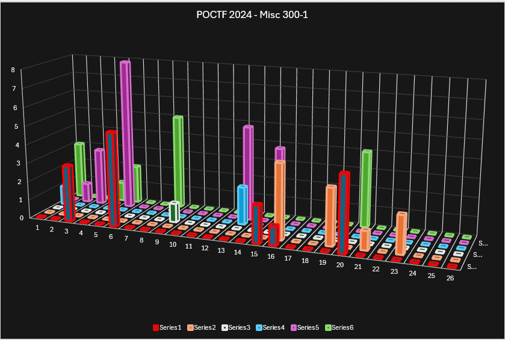

# Misc 300-1 - The Hollow Howl of Foreign Winds
## Description
Business is not my forte. I can't even say the letters MBA in succession without drifting off half-way through. In my experience, business is for Important People doing Important Things because they are Important. A lot of talk, a lot of taking people's useful work and ruining it with efficiencies and bureaucracies, and not a lot of actually doing. And the jargon... How can anyone talk so much and say so little. And that's coming from someone in academia, where talking for the sake of talking is a competitive event!

That said, I do have respect for people that are shrewd in business. You have to be smart to work the system and get everyone pulling the same direction.

You might be asking how I reconcile this cognitive dissonance? Well, if you look at the chart below, you'll see how at the end of the day, it's all about creating synergistic alignment to leverage our core competencies and maximize ROI. We need to circle back on the low-hanging fruit and figure out how to move the needle while we take this offline to ensure we're not boiling the ocean. It's critical to peel back the onion and drill down into the granular details to optimize our operational workflow and streamline efficiencies. We must embrace blue-sky thinking that positions us as thought leaders in our industry. Before we reinvent the wheel, let's ensure we're not creating analysis paralysis, because the goal is to achieve paradigm-shifting outcomes with a focus on value-added deliverables. By maintaining laser focus on our strategic imperatives, we can drive engagement, create stakeholder buy-in, and ensure the right people are in the right seats. Let's keep our north star in mind and ensure we're future-proofing with a proactive, rather than reactive, mindset to ensure we have the bandwidth to pivot when the goalposts shift.

## Solution
Series $x$ represents the $x$th word of the flag. The axis from 1 to 26 represent the alphabet. The heights represent the sum of the positions of the corresponding letter. Series 1 spells out poctf, series 2 uwsp, and so on.

## Flag
`poctf{uwsp_1_4m_b3c0m3_d347h}`
