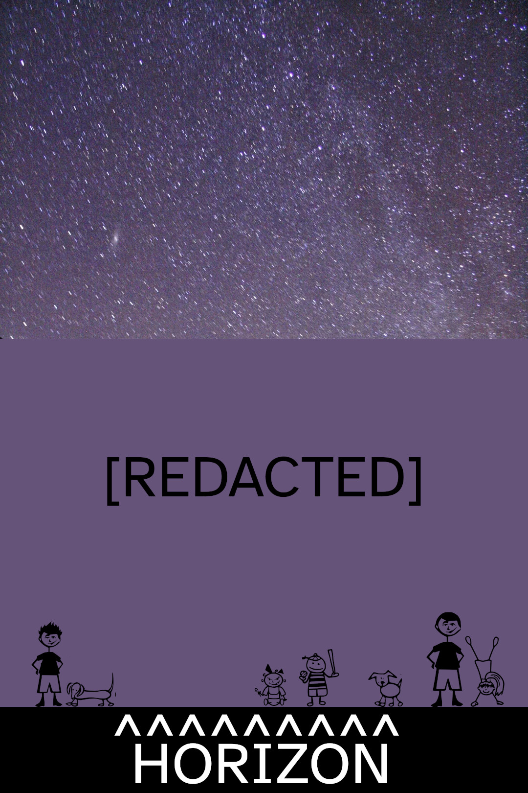
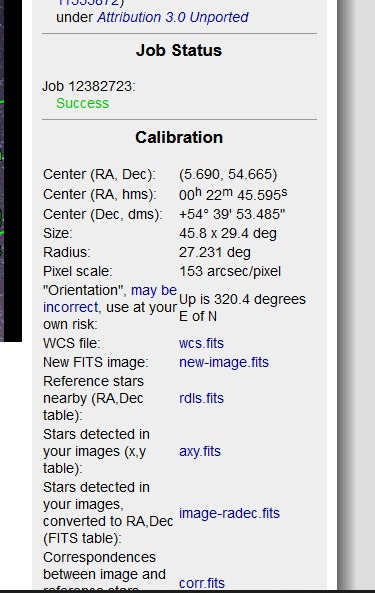
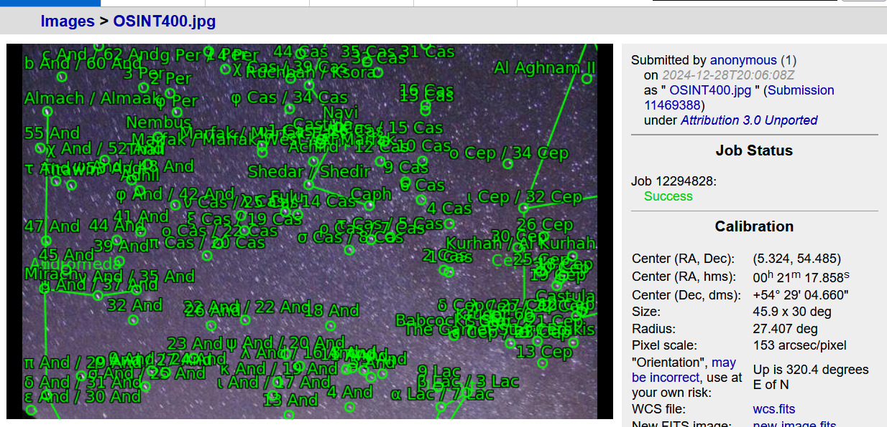
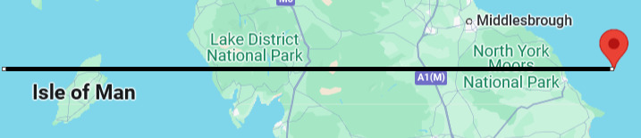
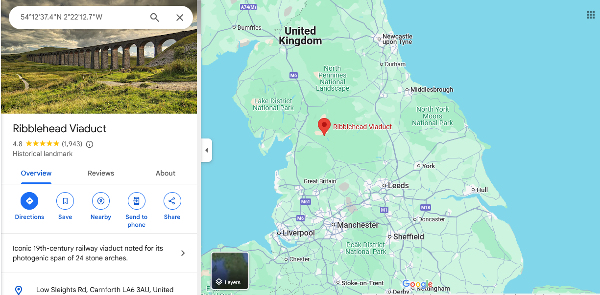
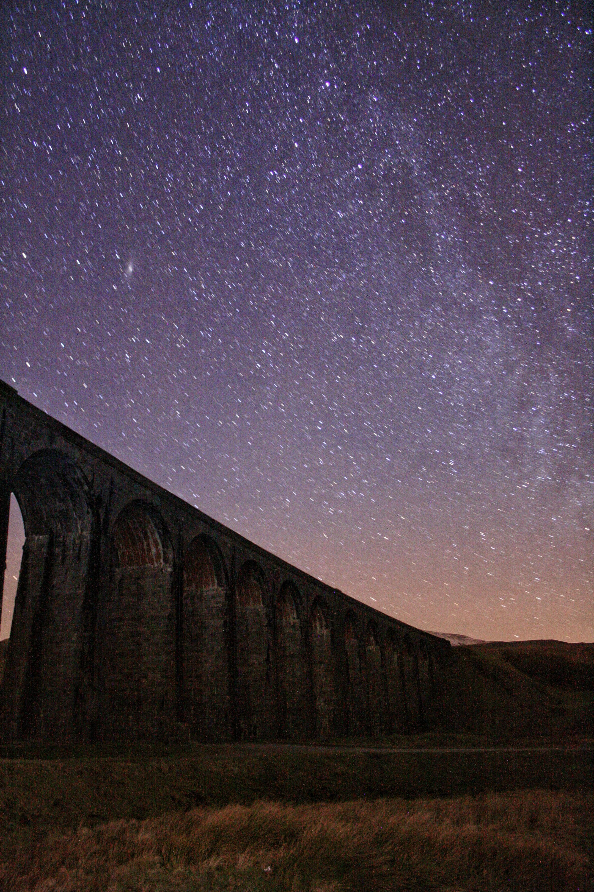
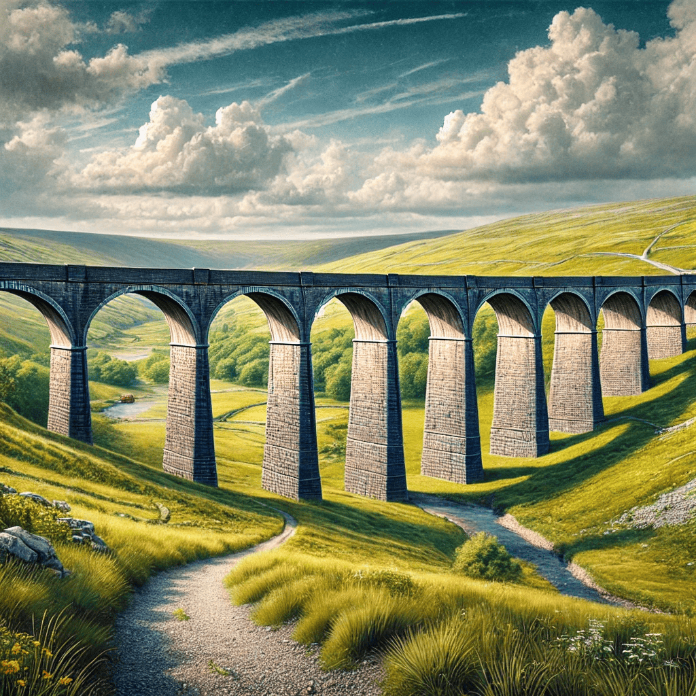
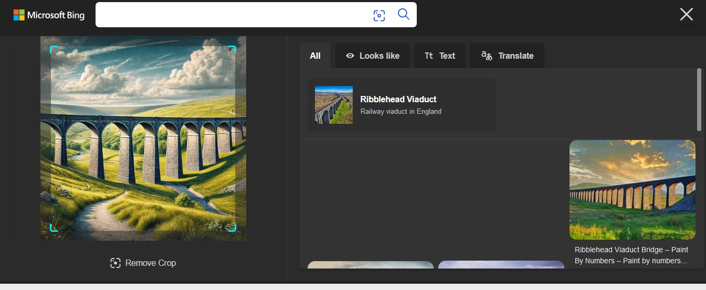
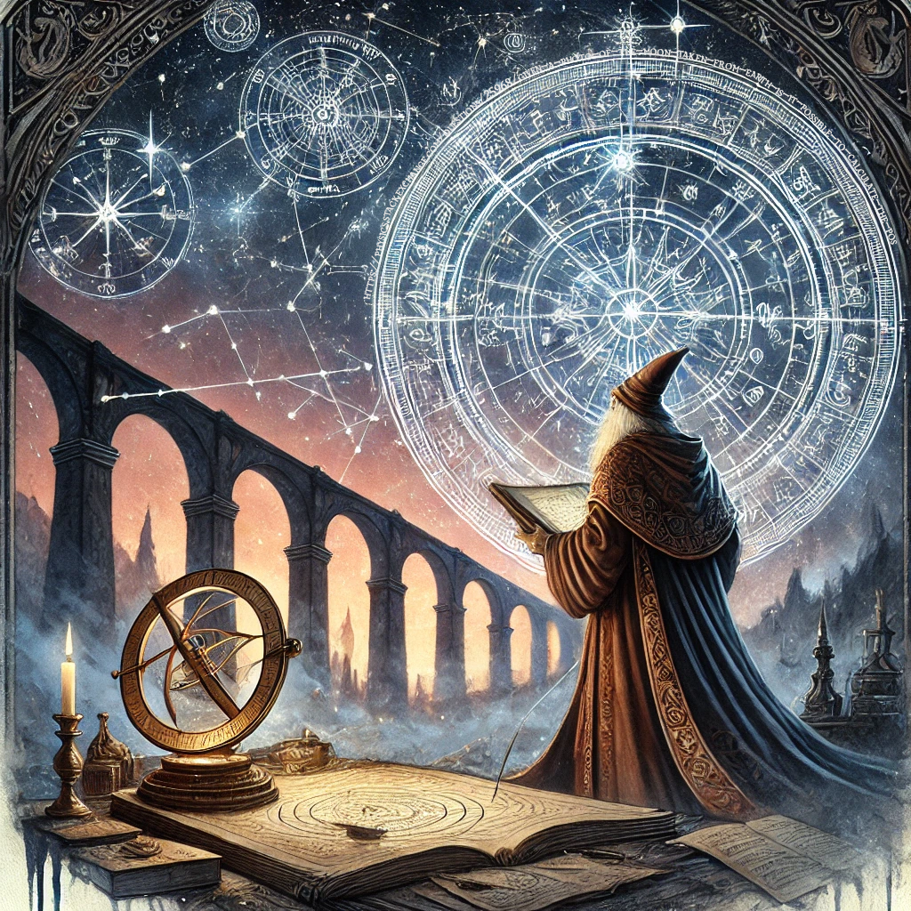

# OSINT 400 - I Couldn't Bring Myself to Shoot
## Description
So here we are. The last 400-level challenge of the 2024 contest and the last challenge in project 400. For this one, I created what I consider to be the ultimate OSINT challenge. About a year ago I came across some posts on social media. They were pictures someone took out of the window on their airplane as they traveled. No details on where or when. No landmarks to work with. I challenged myself to try and work out where they were at the moment the picture was captured. That led me on a journey of learning new (to me, anyway) ways of gathering forensic artifacts from images (a process I call Forensic Iconography.)

Now, here is your chance to do the same thing. Maybe it will be easier for you than it was for me, but I was able to get there in the end. Below is an image I found on social media. I have redacted all information other than the night sky.



MD5 checksum FB793887792EA8A0CBE568A5E9B83E27

This image was taken at a location with its own entry on Wikipedia. Your task - find where this image was taken, then locate that Wikpedia page. In the Talk section of that page there was a user that doesn't think The Daily Mail is a reliable source. The identifier for the user that made that note is the password for the VeraCrypt archive below.

One final note: Don't expect too much help from me on this. Over the last 17 weeks I've been dropping clues about Crack 400 here and there. Well, I've also secretly been dropping clues for this challenge as well. If you're struggling, the hints are already out there. 

Right Click, Save As... [Twinkle Twinkle](https://pointeroverflowctf.com/static/OSINT400)

MD5 checksum B5CA2260522868FB5B2472A13E8A027F

## Solution
### Red herrings/easter eggs
First, check the metadata on the picture. Unfortunately it only contains red herrings (befitting the theme).
- The GPS location is [33 deg 44' 50.28" N, 112 deg 38' 2.04" W](https://maps.app.goo.gl/KxkhSLBUEQzPnWbv8)
, which shows a mysterious giant triangle and [is actually an abandoned Air Force Base called Luke Aux #4](https://www.earth.com/image/giant-triangle-wittmann-arizona/).
- [Tarapaca Gigante](https://en.wikipedia.org/wiki/Atacama_Giant) is an anthropomorphic geoglyph on the Cerro Unitas area of the Atacama Desert, Chile.
- "Not from the stars do I my judgement pluck, [...] But not to tell of good or evil luck." is a [quote from Shakespeare](https://nosweatshakespeare.com/sonnets/14/).

### Solve process
Reverse image searches on the given image or cropped sections do not show any promising leads.

The first part of the challenge description refers to the process documented at https://youtu.be/S2Iyti7DEwk?si=IU21bc0e8pEGjuhT&t=561.
Accordingly, crop the upper part of the image and upload to https://nova.astrometry.net/, which returns following data:

.


Interestingly, we can also find the following submission in the history of uploads on the astrometry website, dated 2024/12/28:



This Astronomy StackExchange post also describes the process to reverse the coordinates: https://astronomy.stackexchange.com/questions/25530/given-a-stars-ra-dec-how-can-i-compute-one-pair-of-lat-long-and-time-where-th (but also need to take into account the altitude with respect to the horizon)
- The correct latitude should be close to the star's declination, i.e. ~54.5 DD:
  

- The longitude depends on the time the photo was taken (GPS timestamp indicates 22:44:26, however unclear if this is correct), but here we decide to use another approach since the results will probably be off by a few km anyway.
  
(Contextual clues such as the [Daily Mail](https://www.dailymail.co.uk/) reference also help in confirming the UK location.)

Use the [Wikipedia API](https://www.mediawiki.org/wiki/API:Main_page) to retrieve Wikipedia articles [close to given coordinates](https://www.mediawiki.org/wiki/API:Geosearch) 
and fetch the usernames and userids of the [revisions](https://www.mediawiki.org/wiki/API:Revisions) for those pages.
(Initially, we also filtered on edits with comments containing keywords such as `Daily Mail` or `unreliable`, but this did not yield the correct answer.) 

These can then be piped to hashcat to crack the hash of the Veracrypt container (which took approximately 1h40m):

```./get_wiki_usernames_uk.py | hashcat hash -o cracked.txt -a 0 -m 29421```

The username (or rather IP address, because it is an [unregistered user](https://meta.wikimedia.org/wiki/Unregistered_user)) is found to be **2A00:23C5:FC94:C400:C8C8:1241:9455:9E3A**.
This password can then be used to decrypt the container and reveal the flag.

```sudo veracrypt -t --non-interactive --mount OSINT400 -p $PASSW```

On Wikipedia, on the page about the [Ribblehead Viaduct](https://en.wikipedia.org/wiki/Ribblehead_Viaduct), we can see this IP in the [Talk section](https://en.wikipedia.org/wiki/Talk:Ribblehead_Viaduct) and [Edit History](https://en.wikipedia.org/w/index.php?title=Ribblehead_Viaduct&action=history).
So combining all this information establishes [the location of the photo](https://geohack.toolforge.org/geohack.php?pagename=Ribblehead_Viaduct&params=54.2104_N_2.3702_W_).



After some searching, we can now also find the original social media post at https://www.reddit.com/r/pic/comments/eupqyo/milky_way_above_ribblehead_viaduct_north_yorkshire/



### Additional hints
In the Discord channel, the following pictures were posted some weeks beforehand:
#### Posted on 2024/12/02


A picture of the viaduct in broad daylight. (We did not consider this as a clue during the solving because we did not look so far back for clues.)

A cheesy solution would have been to reverse image search this one:



#### Posted on 2024/12/15. 


This picture clearly hints at this challenge (the wizard is depicted with a sextant and stars in the sky) and also gives a clue for the location: near a viaduct.
Something like https://en.wikipedia.org/wiki/List_of_railway_bridges_and_viaducts_in_the_United_Kingdom was considered to narrow down the search (see `get_uk_viaducts.py`, which finds the correct username in 15 minutes). 


####  Posted on 2024/12/24. 


This picture shows an obscured view of the nearest accommodation (a walk about 600 m to the viaduct), [the Station Inn Ribblehead Viaduct](https://maps.app.goo.gl/sFNaVzFenLXqLggj9).
(This clue was only understood after the location was already found.)

## Flag
`poctf{uwsp_cur10us3r_4nd_cur10us3r}`
