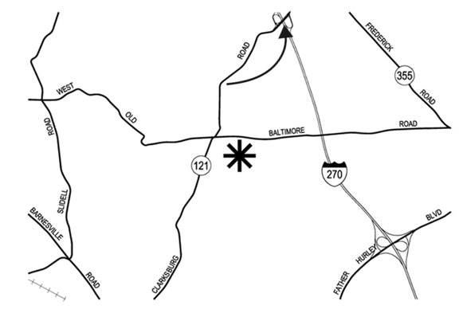

# OSINT 300-1 - Intimidation by Ecolocation
## Description
You objective for this challenge will be in three parts.

Part 1 - Find the user. Do not contact anyone regarding this challenge, as there may be legitimate users with this moniker (unlikely thought hat may be.) The account used in the challenge is not monitored, so you'll get no help anyway. The username is 0tYGJH2E

Part 2 - Find the location of the flag. You'll need to find the right URL.

Part 3 - Find the password to access the flag by finding the location indicated in the image. There is a sign at the place indicated by the arrow, and those words are the password (no spaces or special characters.) For example, if the sign reads, "Employee Parking Only" then your password is "EmployeeParkingOnly"

## Solution
After searching for a while and retrying a few times with https://whatsmyname.app/, the following was found:
https://mastodon.social/@0tYGJH2E

There are 2 posts on this account: an image containing a map and a video containing an url to a pastebin.
- The map points to a sign at https://maps.app.goo.gl/NaW723PDWneVs7pb9 which reads: "HOV LANE ENDS". The password is thus **HOVLANEENDS**.

- The video shows the url to a password-protected pastebin at https://pastebin.com/0tYGJH2E which unlocks the flag.

## Flag
`poctf{uwsp_1_4m_7h3_0n3_wh0_kn0ck5}`
