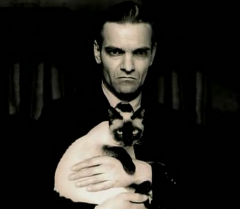
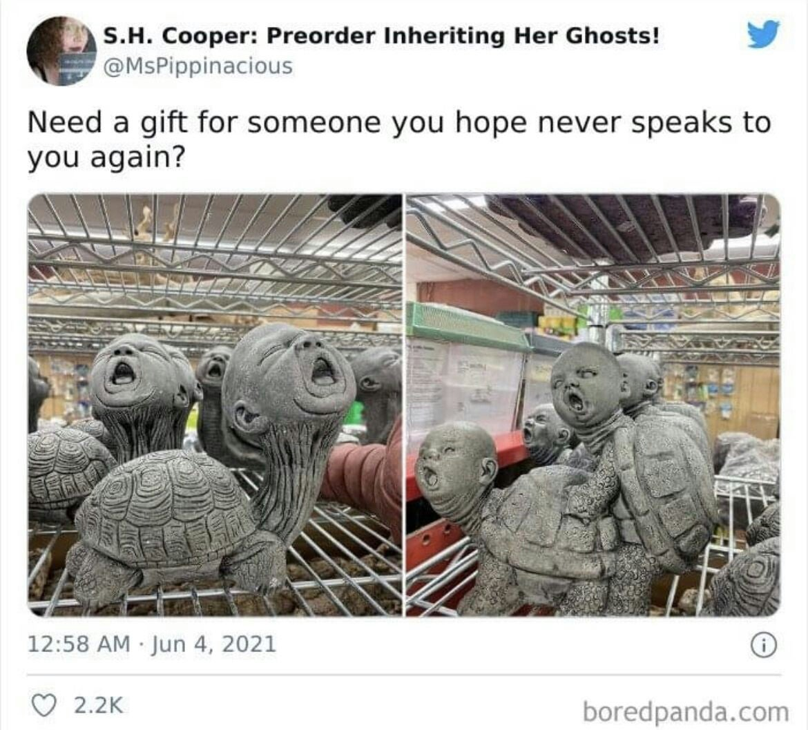

# OSINT 300-3 - Not All Secrets are Exciting
## Description
Wasn't last year's multi-part OSINT challenge a blast? Let's do that again! Attached to this challenge is a VeraCrypt container. The password for this container is in three parts and you're going to need to do some searching to assemble them.

Let's start with this one. The first part of the password is the full name of the cat. Make sure it's capitalized to put some respect on it.

Add a dash (-) to separate the next part, which is the last name of the artist that makes these awesome sculptures. Make sure it's capitalized to put some respect on it. 

Add a dash (-) to separate the next part, which is the street number and five-digit zip code of the building where this picture was taken. For example, if the address is 1234 Main St. Nowhere, US 54321-4321 the solution would be 123454321. 

Right Click, Save As... [Capitalized To Put Some Respect On It](https://pointeroverflowctf.com/static/OSINT300-3)

MD5 checksum: F2FFA49768EA2D4F6A1FAB9852F1648D

## Solution
- First picture is [Yuri Knorozov](https://en.wikipedia.org/wiki/Yuri_Knorozov) and his cat [Aspid](https://www.reddit.com/r/Catswithjobs/comments/1aozbxw/soviet_scientist_yuri_knorozov_and_his_cat_aspid/) (a.k.a. [Asya](https://www.reddit.com/r/OldSchoolCool/comments/unpdzi/yuri_knorozov_the_linguist_who_deciphered_the/)).

- Second picture: [Jeff Galewood ](https://www.reddit.com/r/HelpMeFind/comments/gbi8kl/creepy_turtle_baby_hybrid/) is the artist.

- Third picture: [tineye reverse image search](https://tineye.com/search/0e109b63b69a1bd83325fd848610120ee810a44a?sort=score&order=desc&page=1) leads to this [blog post]( http://siobhanfallon.com/blog/?tag=nevada-office-of-veteran-services).
The hotel is located at [3790 S Las Vegas Blvd, Las Vegas, NV 89109, United States](https://maps.app.goo.gl/hX6bkEPmuHAyRKCZ6).

The password is **Aspid-Galewood-379089109**

## Flag
`poctf{uwsp_411_7h3_b357_p30p13}`
