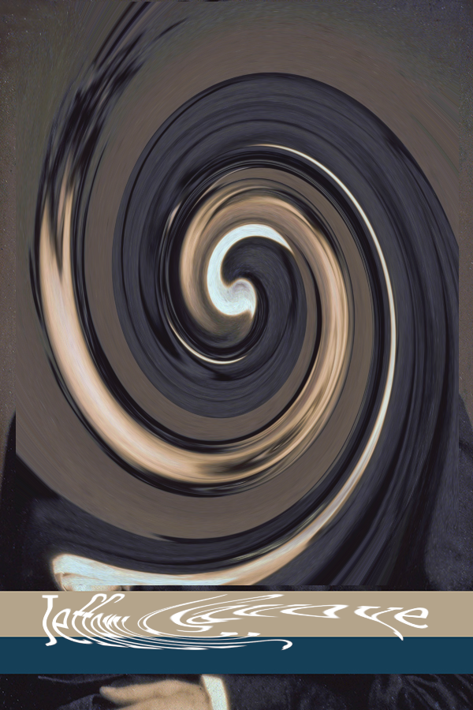
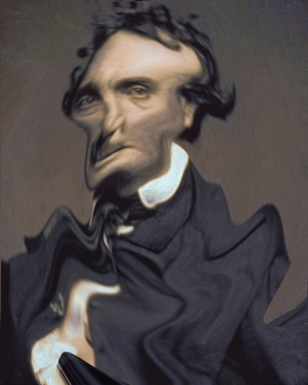

# OSINT 100-2 - Novel Means of Lying
## Description
It's nearly Halloween (for those countries that celebrate it.) Naturally, I'm also a bit of a fan of the horror genre so this is a great time of year for me. In this challenge, I'd like for you to track down a series of people that seem to have a similar fascination. It will require multiple steps.

First, reverse the distortion on this image. Find out who these people are, and what they have in common. 

This month (October 2024) was a very special anniversary. They even held a modest event to commemorate it with a keynote presentation.

It looks incredibly interesting! The password for the archive that contains the flag is the work phone number of the speaker exactly as you find it (special characters and all.)

## Solution
`exiftool` reveals that GIMP has been used. Use GIMP to undo the distortion using `Filters > Distorts > Whirl and Pinch`. Apply this to the portrait part and text part independently (only the whirl parameter has to be tweaked to obtain reasonable results).

Jeffery A. Savoye is someone who researches Edgar Allan Poe. The portrait is indeed one of Edgar Allan Poe (as found [here](https://www.psupress.org/journals/jnls_EAPR.html)). 
Moreover, this year is indeed the 75th anniversary of Edgar Allan Poe. One of the events in October 2024 was https://www.eapoe.org/society/psbevnts.htm, where Ashley Kniss, an Associate Professor at Stevenson University, is a speaker. 
Her phone number is **443-352-4039** as found on https://www.stevenson.edu/academics/schools/school-humanities-social-sciences/hass-faculty/ashley-kniss/.

## Flag
`poctf{uwsp_7h3_r4v3n_n3v3rm0r3}`
