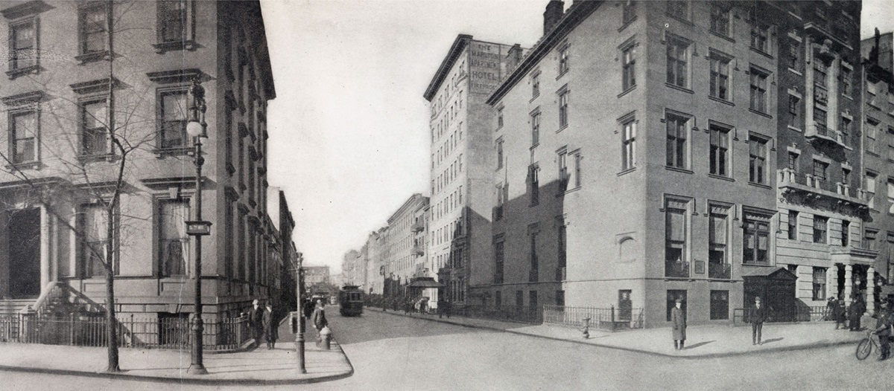

# OSINT 100-1 - Who Can It Be Now   
## Description
A trip through time through the power of open-source intelligence! Start by finding the location in this image: 

Boy, I bet it's changed a lot in a century or so. You should find out. If you do, you'll see a business on the corner with a rustic chic style. Convert the words on the awning closet to the intersection into a flag using the alphabet in the rules and accept your daily bread. (i.e. poctf{uwsp_ _ _ })

## Solution
Reverse image search leads to https://www.villagepreservation.org/2024/10/31/becoming-fifth-avenue-the-brevoorts/ which identifies the location as 10 5th Avenue, New York in 1911.

We can find the current situation using Google street view: https://maps.app.goo.gl/WuZi4BwJt3t3GQ7Y6
Now, there is a "le pain quotidien", which corresponds with the hint (your daily bread).

## Flag
`poctf{uwsp_l3_p41n_qu071d13n}`
