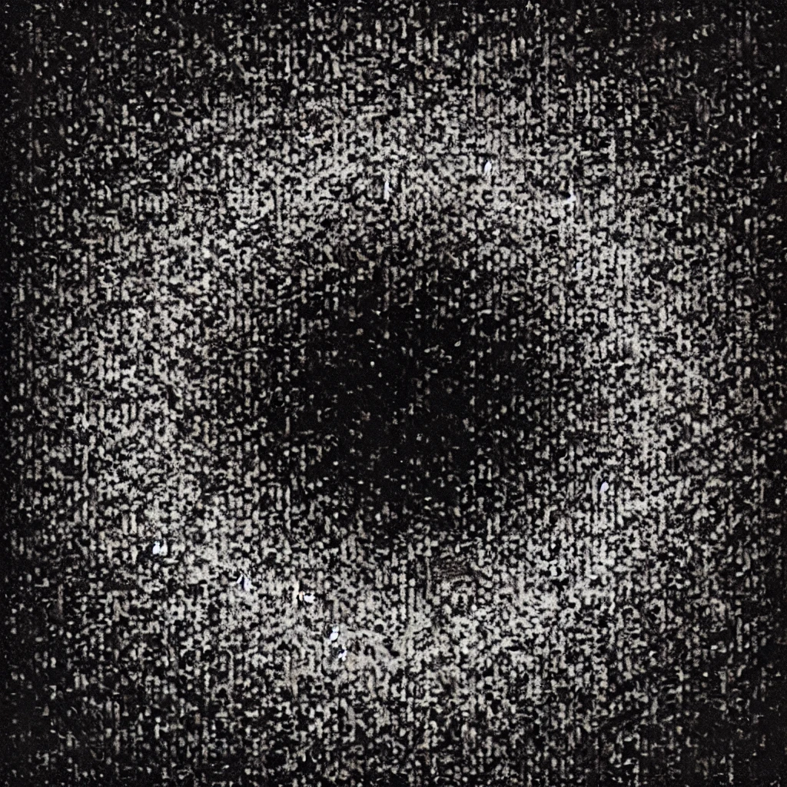

# Stego 300-2 - Everything and Nothing
## Description
Happy end-of-the-year, sigmas! I think by this point of the contest we've weeded out all the betas and are down to only those big dawgs able to hang with the pack. Still, lots of contest left to go and plenty of time to delta out of here before the big gamma burst brings omega.

Let's take this challenge, for example. You have here an image. There are so many places to hide data in images, but hiding data in a greyscale image is actually a lot harder than a color image because you're cutting out all but the luminescence channel and that's a huge reduction in data. The question is, what is grey? Or, more importantly, what appears grey? 

MD5 checksum 309eba0a4f350f5fd66c0809234ce473

## Solution
`zsteg`

## Flag
`poctf{uwsp_n07_4ll_7h053_wh0_w4nd3r}`
