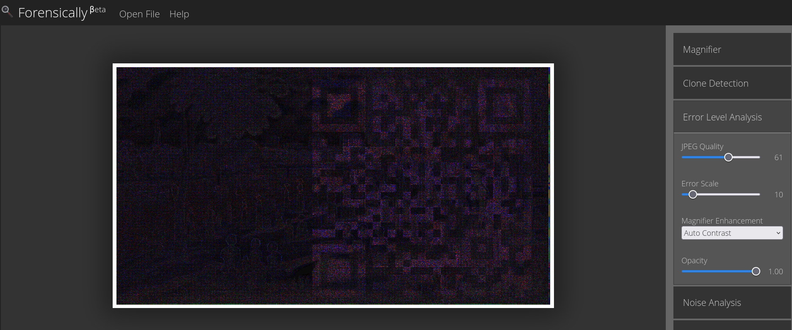
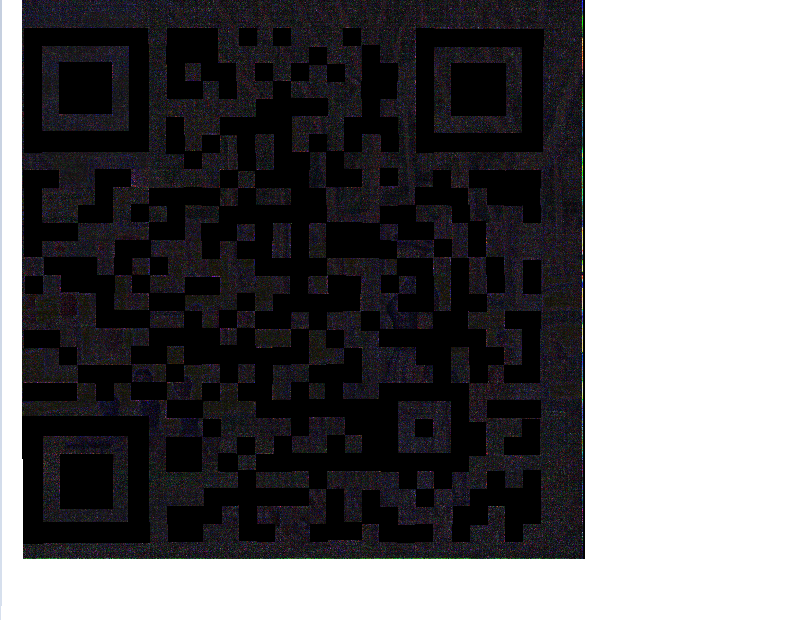
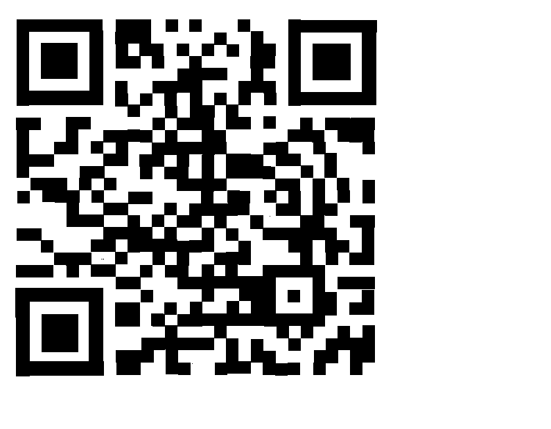

# Stego 200-2 - Little Things Matter the Most
## Description
In a world of chaos and clutter, it's often the little things that hold the greatest secrets. Little also tend to add up. I've always thought of the truth as being like Seurat's A Sunday Afternoon on the Island of La Grande Jatte, where you get only little dots of truth, but if you get enough of them you can back up and see the big picture. I tried to have AI generate my own version of this, but it is unable to come close to the original. I'm not really surprised, and there is a part of me that is glad that, at least for now, the care and creativity of humans is unassailable.

MD5 checksum 309C5245084ED083FEB279E0A72525D6

## Solution
Open image in `https://29a.ch/photo-forensics/#error-level-analysis`. Using Error Level Analysis with parameters JPEG quality 61, Error Scale 10, Magnifier Enhancement "auto contrast", Opacity 1.00, one obtains the image

which reveals a QR-code. This is still too noisy for decryption, therefore we use paint to place black squares where we expect them to be. This gives the result

Changing every non-black pixel to white yields

which can be decoded to reveal the flag.

## Flag
`poctf{uwsp_7h47_wh1ch_d035_n07_k1ll}`
