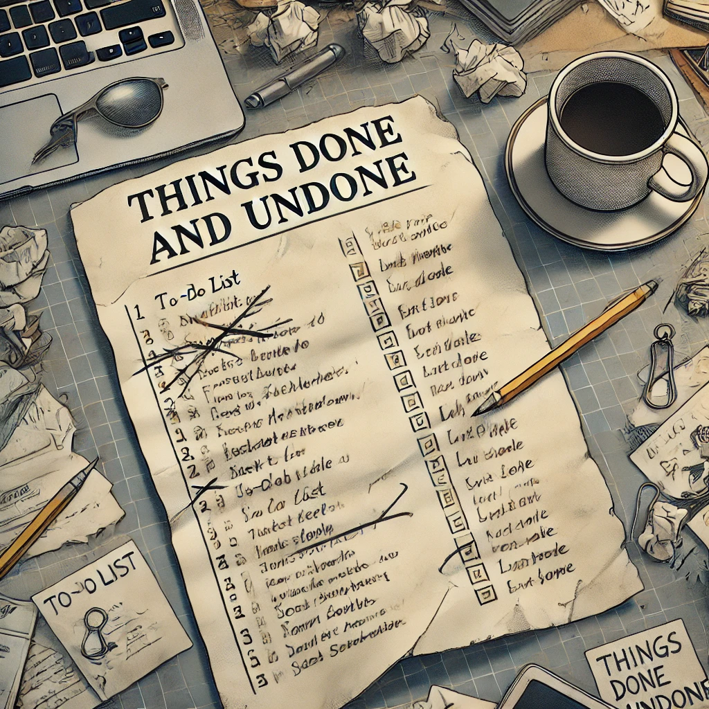

# Stego 200-3 - Things Done and Undone
## Description
You know, I can't help but feel like the Stego challenges have been missing something. Like, it's almost as if several of the challenges contained clues that hinted that a certain method was employed, and then it turns out that they actual indicated some other method. It's honestly starting to bother me. It's like knowing that something is just a little bit off but not being able to identify it. Like there's unfinished business to tend to. I normally wouldn't let something so insignificant bother me, but I just can't leave things undone like this.

MD5 checksum 2876292ECFD2A6C588E356956C519B32

## Solution
`zsteg -a Stego200-3.png`

## Flag
`poctf{uwsp_70_b3_0r_n07_70_b3}`
