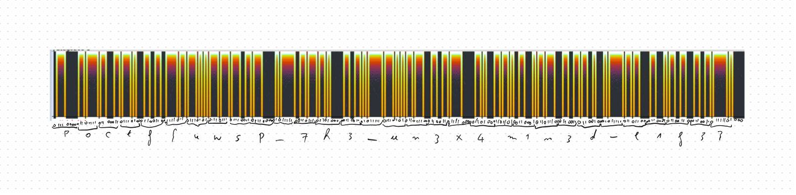

# Stego 200-1 - You Never Liked My Music
## Description
Did I ever mention that I used to want to be a professional musician? It's true. It never really worked out. Probably because I wasn't very good. Still, for a good portion of my 20's I did the whole thing with garage bands and trying to get recognized and everything. I really wanted to make a mark on the world, but didn't really have any means to do it. So I did the next best thing and I made a lot of noise to be heard. Never seemed to work, though. Always fell on deaf ears. I gave up the dream after I entered university and discovered my next passions, and that brings us together today!

Still, I've always had an affinity for music. Even as the years of loud music take their toll on my poor ears. I'm luckier than some since my hearing is still pretty good. Still I get tinnitus ringing in my ears more often now and I know when that happens that it means that I'm waving goodbye to another frequency of sound. The only bonus is that now I can play annoyingly high pitched sounds to irritate the youngsters and it doesn't bother me a bit!

Anyway, I managed to find an old recording of my jazz drummer days to share with all of you. Oh, the dreams of a desperate kid. Enjoy!

Right Click, Save As... [Dig That Rhythm Daddio](https://pointeroverflowctf.com/static/Stego200-1.wav)

MD5 checksum 9C6CA614164743A7DF6CAF2299DB278A

## Solution
View spectrogram above 19kHz; the flag is binary encoded.

## Flag
`poctf{uwsp_7h3_un3x4m1n3d_l1f3}`
